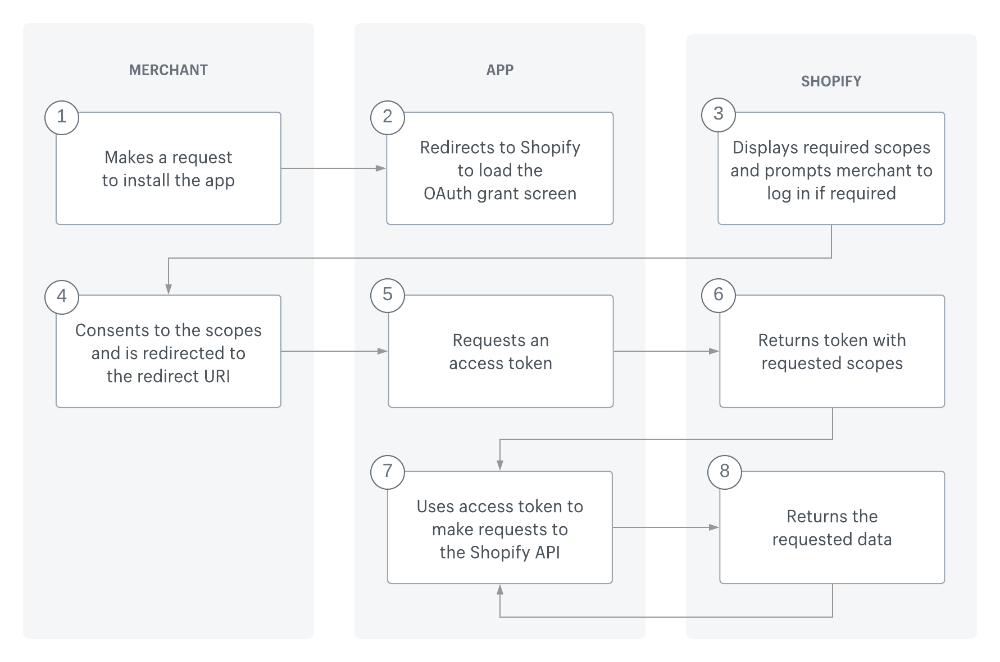
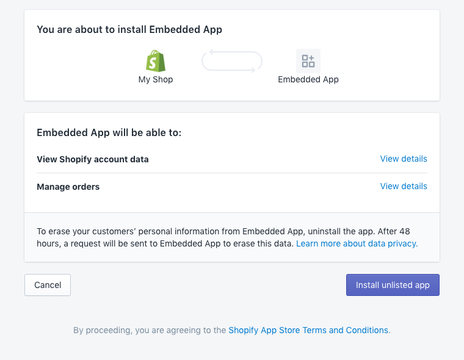

## Available Scripts

In the project directory, you can run:

### `npm start`

Runs the app in the development mode.\
Open [http://localhost:3000](http://localhost:3000) to view it in the browser.

The page will reload if you make edits.\
You will also see any lint errors in the console.

### `npm run dev`

Runs the firebase emulator

### `npm run start-up`

Runs the start-up.bash file to import DB


## Deploy

### `npm run build` and ### `firebase deploy --only hosting`


## How to change DB

Go to the src/constants/index.js, and you'll see a constant "collection_name".
Change it.

### `npm run build` and ### `firebase deploy --only hosting`

<h1 align="center">
  Project Summary
</h1>

## 🧐 What's inside?

A quick look at the top-level files and directories you'll see in the project root.

    .
    ├── node_modules
    ├── firebase
    ├── public
    ├── src
        ├── _actions
        ├── _config
        ├── _reducers
        ├── Auth
        ├── Components
        ├── constants
        ├── hooks
        ├── pages
        ├── styles
        ├── utils
    ├── .gitignore
    ├── .prettierrc
    ├── package-lock.json
    ├── package.json
    └── README.md
1.  **`/node_modules`**: This directory contains all of the modules of code that your project depends on (npm packages) are automatically installed.

2.  **`/src`**: This directory will contain all of the code related to what you will see on the app dashboard (what you see in the Shopify admin) such as the table and tob bar. `src` is a convention for “source code”.

3.  **`_actions`**: This directory will contain all actions for Redux.

4.  **`_reducers`**: This directory will contain all reducers for Redux.

5.  **`Auth`**: This directory will contain the code to handle OAuth process for Shopify App bridge and Firebase.

6.  **`Components`**: This directory will contain all components such as Datatable, Indextable, TobBar, Spiner, BulkEditor...

7.  **`Constants`**: This directory will contain constants like EditableColumns

8.  **`Hooks`**: This file will contain hooks like useAuth.

9.  **`Pages`**: This directory will contain pages such as Home, Login, Tabs, Delivery, SpecialNote, BulkEditor...

10.  **`Styles`**: This directory will contain CSS files to style pages and components

11.  **`Utils`**: This directory will contain Firebase config files and common functions.

12.  **`.gitignore`**: This file tells git which files it should not track / not maintain a version history for.

13.  **`.prettierrc`**: This is a configuration file for [Prettier](https://prettier.io/). Prettier is a tool to help keep the formatting of your code consistent.

14.  **`config.js`**: This is the main configuration file for the project. This is where you can specify information about the Firebase datbase and hosting setting.

15. **`package-lock.json`** (See `package.json` below, first). This is an automatically generated file based on the exact versions of your npm dependencies that were installed for your project. **(You won’t change this file directly).**

16. **`package.json`**: A manifest file for Node.js projects, which includes things like metadata (the project’s name, author, etc). This manifest is how npm knows which packages to install for your project.

17. **`README.md`**: A text file containing useful reference information about your project.
<br/><br/><br/>

<h1 align="center">
  Technologies used for this project
</h1>

1.  **`Firebase`**: Hosting Solution 

2.  **`Firestore Database`**: Database system

3.  **`React`**: Frontend 

4.  **`Node`**: Backend

5.  **`Cloud Functions`**: Shopify OAuth Redirect URL

6.  **`Polaris`**: UX/UI Design - Shopify Built-In Component library

7.  **`Redux`**: State Management

8.  **`Shopify App Bridge`**: OAuth Authentication

9.  **`Linear Search`**: Search Algorithm
<br/><br/><br/>

<h1 align="center">
  Firebase Cloud Functions API
</h1>

### Default Route [https://us-central1-fulfillments-admin.cloudfunctions.net](`https://us-central1-fulfillments-admin.cloudfunctions.net`) 

1.  **`helloWorld`**: Test API \
**RES** :  "Hello From Firebase"

2.  **`erase`**: GDPR mandatory webhooks \
**RES** :  "Thank you"

3.  **`requestData`**: GDPR mandatory webhooks \
**RES** :  "Request Received"

4.  **`oauthCallback`**: Auth CallBack URL \
**RES** :  `{
    hmac: HMAC,
    shop: SHOP,
    code: CODE,
    ACCESS_TOKEN: access_token    
}`

<br/><br/><br/>

<h1 align="center">
  Shopify Embed APP Development
</h1>

### Reference Guide `https://shopify.dev/apps` 

1.  **`Developer Tools`** \
**Shopify App CLI** :  Automation Tool to build a Shopify App. \
**Shopify API** :  API library to manage resources, onine stores, plans... \
**Shopify App Bridge** :  Shopify’s out-of-the-box library of UI actions and components.

2.  **`How to Build a Shopify App`** \
### OAuth Process : 
Online access must be explicitly requested during the authorization phase of OAuth. Tokens with online access mode are linked to an individual user on a store, where the access token's lifespan matches the lifespan of the user's web session. \
<br>

### The OAuth Flow :

- The merchant makes a request to install the app.
- The app redirects to Shopify to load the OAuth grant screen and requests the required scopes.
- Shopify displays a prompt to the merchant to give authorization to the app, and prompts the merchant to log in if required.
- The merchant consents to the scopes and is redirected to the redirect_uri.
- The app makes an access token request to Shopify including the client_id, client_secret, and code.
- Shopify returns the access token and requested scopes.
- The app uses the access token to make requests to the Shopify API.
Shopify returns the requested data. \
<br><br>

### Installation permissions prompt :


- After granting the permission prompt, Shopify returns the access_token

- PERMISSION PROMPT URL: \
 ```
 https://{shop}.myshopify.com/admin/oauth/authorize?client_id={api_key}&scope={scopes}&redirect_uri={redirect_uri}&state={nonce}&grant_options[]={access_mode}
 ```
- Confirm installation: \
```
https://example.org/some/redirect/uri?code={authorization_code}&hmac=da9d83c171400a41f8db91a950508985&host={base64_encoded_hostname}&timestamp=1409617544&state={nonce}&shop={shop_origin}&host={host}
```
- Get a permanent access token: \

```
POST https://{shop}.myshopify.com/admin/oauth/access_token
```

***RESPONSE***

```
{
  "access_token": "f85632530bf277ec9ac6f649fc327f17",
  "scope": "write_orders,read_customers"
}
```

- Grant Access

```
https://{shop}.myshopify.com/admin/oauth/authorize
```
In the URL, {shop} is the name of the merchant's shop and the oauth/authorize link includes the required parameters.

- Verification

```
"code=0907a61c0c8d55e99db179b68161bc00&hmac=700e2dadb827fcc8609e9d5ce208b2e9cdaab9df07390d2cbca10d7c328fc4bf&shop=some-shop.myshopify.com&state=0.6784241404160823&timestamp=1337178173"
```